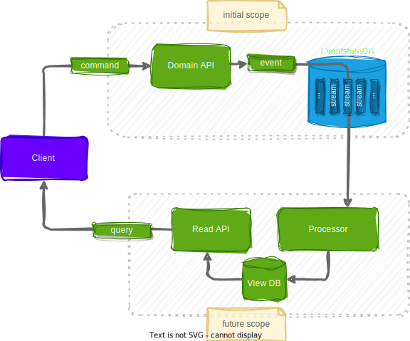
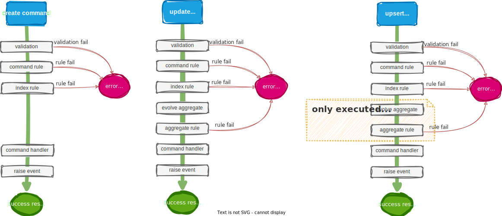
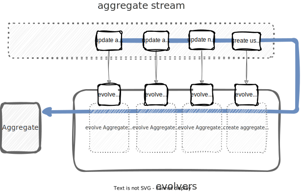

  
  eͤcͨhͪoͦ
  
  
  A framework that echoes your events to multiple destinations and projections.
  

🆆🅾🆁🅺 🅸🅽 🅿🆁🅾🅶🆁🅴🆂🆂

---

# TODO:
> Include vscode plugins etc to install to read this

---

# Table Of Contents
- [TODO:](#todo)
- [Table Of Contents](#table-of-contents)
- [Overview](#overview)
- [Roadmap](#roadmap)
- [Domain API](#domain-api)
  - [Glossary of Terms](#glossary-of-terms)
    - [Domain](#domain)
    - [Domain API](#domain-api-1)
    - [Aggregate](#aggregate)
    - [Domain Event](#domain-event)
    - [Command](#command)
        - [Create Command](#create-command)
        - [Update Command](#update-command)
        - [Upsert Command](#upsert-command)
    - [Command Validation](#command-validation)
    - [Command Rules](#command-rules)
        - [Command Rule](#command-rule)
        - [Index (Command) Rule](#index-command-rule)
        - [Aggregate (Command) Rule](#aggregate-command-rule)
    - [Command Handler](#command-handler)
  - [Command handling pipeline](#command-handling-pipeline)
  - [Evolvers](#evolvers)
- [Basic Usage](#basic-usage)
    - [Setup Solution](#setup-solution)
    - [Running Solution (in containers)](#running-solution-in-containers)
    - [Container Links](#container-links)
- [Development Usage](#development-usage)
  - [Creating/Updating Domain API](#creatingupdating-domain-api)
      - [Add Domain API](#add-domain-api)
      - [Add Aggregate to Domain](#add-aggregate-to-domain)
      - [Add Create Command to Aggregate](#add-create-command-to-aggregate)
      - [Add Update Command to Aggregate](#add-update-command-to-aggregate)
      - [Add Upsert Command to Aggregate](#add-upsert-command-to-aggregate)
      - [Add Event to Command](#add-event-to-command)
      - [Add Command Rule to Command](#add-command-rule-to-command)
      - [Add Index Rule to Command](#add-index-rule-to-command)
      - [Add Aggregate Rule to Command](#add-aggregate-rule-to-command)
  - [Debugging Domain API](#debugging-domain-api)
      - [Debugging outside of container](#debugging-outside-of-container)
      - [Debugging inside of container](#debugging-inside-of-container)

---

<pre style="line-height: 1.1;">
████████████████████████████████████████████████████████████
█▄─█▀▀▀█─▄█─▄▄─█▄─▄▄▀█▄─█─▄███▄─▄█▄─▀█▄─▄███████████████████
██─█─█─█─██─██─██─▄─▄██─▄▀█████─███─█▄▀─████████████████████
██▄▄▄█▄▄▄██▄▄▄▄█▄▄█▄▄█▄▄█▄▄███▄▄▄█▄▄▄██▄▄███████████████████
████████████████████████████████████████████████████████████
█▄─▄▄─█▄─▄▄▀█─▄▄─█─▄▄▄▄█▄─▄▄▀█▄─▄▄─█─▄▄▄▄█─▄▄▄▄█████████████
██─▄▄▄██─▄─▄█─██─█─██▄─██─▄─▄██─▄█▀█▄▄▄▄─█▄▄▄▄─█████████████
▀▄▄▄▀▀▀▄▄▀▄▄▀▄▄▄▄▀▄▄▄▄▄▀▄▄▀▄▄▀▄▄▄▄▄▀▄▄▄▄▄▀▄▄▄▄▄▀▄▄▀▀▄▄▀▀▄▄▀▀
</pre>

---

# Overview
> // TODO

**Goal:** A project to explore a simple event-sourcing framework.
> // TODO: mixing DDD & CQRS principles, with simplifications to model domain as an API, and using code-generation

> // TODO: Tech used: Rush, Docker, Commander, ...

---
---

# Roadmap
**Initial Scope**
  - [X] Improve debug experience in container 
  - [ ] cleanup (TODO's sprinkled in code)

  - [ ] domain operation metrics
  - [ ] ZOD integration
  - [ ] Improve Logger
  - [ ] refactor builder to have a single "source of truth" for:
    - [ ] folder structures
    - [ ] folder & file names

**Future Scope**
- [ ] queries
- [ ] processor
- [ ] event schema migration and synchronization

---
---

# Domain API
## Glossary of Terms

### Domain
The subject area being modelled.

### Domain API
The solution-space representation of the Domain, expressed as an API.
_Usage: [Add Domain Api](#add-domain-api)_

### Aggregate
Represents a group of domain entities that should change together.
In event-sourcing an Aggregate is built up from a stream of Events.
_Usage: [Add Aggregate to Domain](#add-aggregate-to-domain)_

### Domain Event
Represents a record of changes to an Aggregate.
_Usage: [Add Event to Command](#add-event-to-command)_

### Command
Represents the intent to change a **single** Aggregate.

##### Create Command
A specific type of Command that results in the **creation** of an Aggregate.
_Usage: [Add Create Command to Aggregate](#add-create-command-to-aggregate)_

##### Update Command
A specific type of Command that results in the **change** of an Aggregate.
_Usage: [Add Update Command to Aggregate](#add-update-command-to-aggregate)_

##### Upsert Command
A specific type of Command that results in the **creation or change** of an Aggregate.
An Aggregate will be created if it does not exist.
If an Aggregate exists, it will be updated.
> Prefer the use of Create or Update as they are both more efficient and safer, as the framework can do checking to ensure Aggregate existence for you.
> 
_Usage: [Add Upsert Command to Aggregate](#add-upsert-command-to-aggregate)_

### Command Validation
Logic to validate that the Command is syntactically valid.

### Command Rules
Business (semantic) Rules to ensure that the result of the Command will not put the Aggregate into an invalid state.

##### Command Rule
A specific type of Command Rule that only has access to the Command body itself. 
_Usage: [Add Command Rule to Command](#add-command-rule-to-command)_

##### Index (Command) Rule
A specific type of Command Rule that has access to the Command body and can query for the existence of other Aggregates by ID. 
_Usage: [Add Index Rule to Command](#add-index-rule-to-command)_

##### Aggregate (Command) Rule
A specific type of Command Rule that has access to the Command body and Aggregate. 
_Usage: [Add Aggregate Rule to Command](#add-aggregate-rule-to-command)_

### Command Handler
Logic to update the Aggregate by raising an event.
The Command Handler will only be called if all Command Validation and applicable Command Rules succeeded.

---

## Command handling pipeline
> // TODO

---

## Evolvers
> // TODO

---
---

# Basic Usage
### Setup Solution
- install docker/docker-desktop
- install node 20.5.0 _**(recommend using nvm)**_
- install rush globally
- install pnpm globally
- `rush install`
- `rush build`
> // TODO: add detailed steps
### Running Solution (in containers)
- `rush build`
- `rush package`
- `rush start-service-stack` (if not already running)
- `rush start-api-stack`
- _...once finished running_
- `rush stop-service-stack`
- `rush stop-api-stack`

### Container Links
| service       | link                     | description
| ---           | ---                      | ---
| logstash      | http://localhost:5000    | logstash
| logsearch     | http://localhost:9200    | elasticsearch
| logview       | http://localhost:5601    | kibana
| domain-api    | http://localhost:4001    | domain api

---
---

# Development Usage

## Creating/Updating Domain API

#### Add Domain API
| **command**  | `builder api create my-api 4010` |
|:-------------|:---------------------------------|
| **run from** | **solution** root                |

#### Add Aggregate to Domain
| **command**      | `builder api domain add-aggregate User` |                 |
|:-----------------|:----------------------------------------|:----------------|
| **run from**     | project root                            |                 |
| **add code to:** | src/domain/user/User.ts               | aggregate shape |

#### Add Create Command to Aggregate
|**command**      | `builder api domain add-create-command User CreateUser` |                                   |
|:----------------|:--------------------------------------------------------|:----------------------------------|
|**run from**     | project root                                            |                                   |
|**add code to:** | _src/domain/user/createUser/CreateUser.command.ts_      | command shape                     |
|                 | _src/domain/user/createUser/CreateUser.validate.ts_     | command vaildation                |
|                 | _src/domain/user/createUser/CreateUser.handle.ts_       | handling command & raising events |

#### Add Update Command to Aggregate
|**command**      | `builder api domain add-update-command User ChangeUserName`       |                                   |
|:----------------|:------------------------------------------------------------------|:----------------------------------|
|**run from**     | project root                                                      |                                   |
|**add code to:** | _src/domain/user/changeUsername/ChangeUsername.update.command.ts_ | command shape                     |
|                 | _src/domain/user/changeUsername/ChangeUsername.validate.ts_       | command vaildation                |
|                 | _src/domain/user/changeUsername/ChangeUsername.handle.ts_         | handling command & raising events |

#### Add Upsert Command to Aggregate
|**command**      | `builder api domain add-upsert-command User ChangeUserName`       |                                   |
|:----------------|:------------------------------------------------------------------|:----------------------------------|
|**run from**     | project root                                                      |                                   |
|**add code to:** | _src/domain/user/changeUsername/ChangeUsername.upsert.command.ts_ | command shape                     |
|                 | _src/domain/user/changeUsername/ChangeUsername.validate.ts_       | command vaildation                |
|                 | _src/domain/user/changeUsername/ChangeUsername.handle.ts_         | handling command & raising events |

#### Add Event to Command
|**command**      | `builder api domain add-event User CreateUser UserCreated` |                                     |
|:-----------------|:-----------------------------------------------------------|:------------------------------------|
|**run from**     | project root                                               |                                     |
|**add code to:** | _src/domain/user/changeUsername/UserCreated_V1.event.ts_   | event shape                         |
|                 | _src/domain/user/changeUsername/UserCreated_V1.evolve.ts_  | evolve aggregate with event         |
|                 | _src/domain/user/changeUsername/UserCreated_V1.build.ts_   | build event **(do not change)**     |
|                 | _src/domain/user/changeUsername/UserCreated_V1.is.ts_      | event typeguard **(do not change)** |

#### Add Command Rule to Command
|**command**      | `builder api domain add-command-rule User CreateUser BusinessUserMustHavePassport`  |                    |
|:-----------------|:------------------------------------------------------------------------------------|:-------------------|
|**run from**     | project root                                                                        |                    |
|**add code to:** | _src/domain/user/createUser/indexRules/businessUserMustHavePassport.commandRule.ts_ | command rule logic |

#### Add Index Rule to Command
|**command**      | `builder api domain add-index-rule User CreateUser MustHaveUniqueUserId`  |                  |
|:-----------------|:--------------------------------------------------------------------------|:-----------------|
|**run from**     | project root                                                              |                  |
|**add code to:** | _src/domain/user/createUser/indexRules/mustHaveUniqueUserId.indexRule.ts_ | index rule logic |

#### Add Aggregate Rule to Command
|**command**       | `builder api domain add-aggregate-rule User ChangeUserName NewNameMustBeDifferent` |                      |
|:------------------|:-----------------------------------------------------------------------------------|:---------------------|
|**run from**      | project root                                                                       |                      |
|**applicable to** | Update Commands **only**                                                           |                      |
|**add code to:**  | _src/domain/user/createUser/indexRules/newNameMustBeDifferent.aggregateRule.ts_    | aggregate rule logic |

---

## Debugging Domain API

#### Debugging outside of container
- `rush build` (if dependant projects are not up to date)
- `rush start-service-stack` (if not already running)
- `pnpm build`
- `pnpm start`
- _once finished running_
- `rush stop-service-stack`
#### Debugging inside of container
> // TODO: improve experience
- `rush build` (if dependant projects are not up to date)
- `rush package`
- `rush start-service-stack` (if not already running)
- `rush start-api-stack`
- _once finished running_
- `rush stop-service-stack`
- `rush stop-api-stack`

---
---
